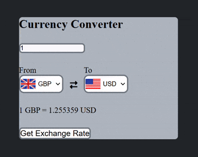

    <a href="https://kishaltandel.github.io/Currency-Converter/">Currency-Converter</a>

 

    

<!-- Note that Exchange Rate for all currencies may not be accessible through this converter due to the API that I have called here -->

<!-- I have created this project just for implementing some concepts of JS -->
